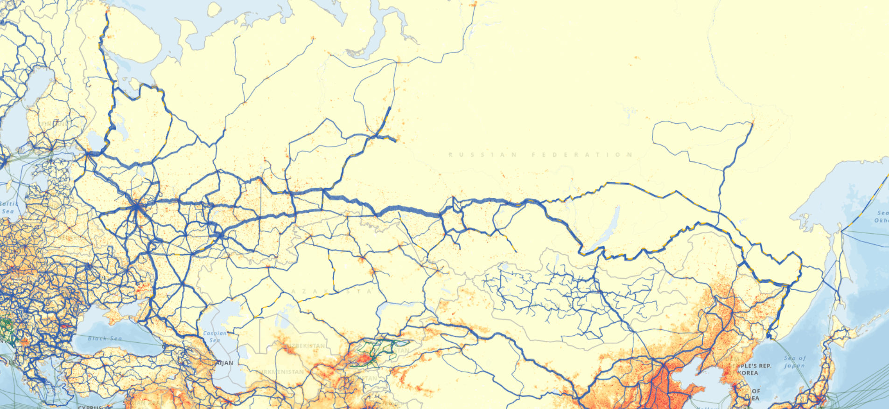
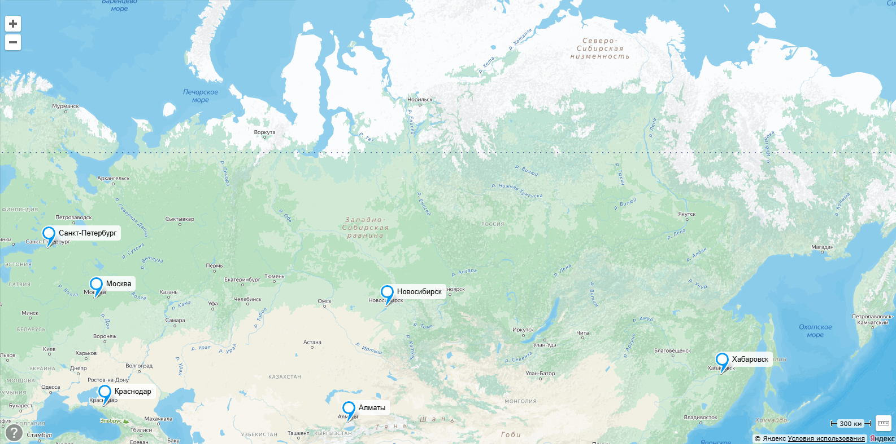

# Яндекс Go

## 1. Тема и целевая аудитория

Яндекс Go – сервис для заказа такси, доставки, каршеринга, аренды электросамокатов.
Изначально возник как сервис для заказа такси, поэтому имеет смысл рассматривать это за основной функционал.

### MVP

1. Регистрация/авторизация для пользователя/водителя
2. Выбор точки подачи/назначения
3. Выбор типа транспорта (легковой, грузовой) и их классы (эконом, комфорт и тд.)
4. Возможность принять заказ для водителя
5. Отслеживание положения автомобиля на карте
6. Чат между пассажиром и водителем
7. Рассчёт стоимости поездки
8. Оплата заказа
9. История поездок
10. Рейтинговая система. Возможность оценить поездку, водителя (для пассажира) и пассажира (для водителя)

### Целевая аудитория

* 42M+ MAU в СНГ [[1], [2], [3]](./README.md#источники)
* ~70% поездок в Яндекс Такси совершается в РФ [[2]](./README.md#источники)
* 91% жителей мегаполисов используют мобильный клиент [[5]](./README.md#источники) 
* 30% пассажиров Яндекс Такси — молодежь до 25 лет [4]
* 20% пользователей Яндекс Такси — семьи с детьми [4]
* 25% пользователей Яндекс Такси используют сервис для работы (деловые встречи и тп.) [4]
* ~94% рынка такси в РФ [7]

## 2. Расчёт нагрузки

### Продуктовые метрики

#### Аудитория

| Метрика | млн. пользователей |
| --- | --- |
| MAU | 42 |
| DAU (2019) [[6]](./README.md#источники) | 4.5 |

#### Действия

| Тип | Среднее в день на пользователя
| --- | --- |
| Регистрация | 0.0004 |
| Авторизация | 1.83 |
| Выбор точки подачи/назначения | 1.64 |
| Выбор типа транспорта | 1.64 |
| Возможность принять заказ | 1.46 |
| Отслеживание положения автомобиля на карте | 2.92 |
| Чат | 0.36 |
| Оплата заказа | 1.64 |
| История поездок | 0.034 |
| Оценки | 1.17 |

$DAU$ = $DAU_{пасс}$ (количество пассажиров в сутки) + $DAU_{вод}$ (количество водителей в сутки).
Согласно [8] в РФ 604 тыс. работающих водителей, а доля рынка Яндекс Такси [7] около 94%.
Таким образом, в Яндекс Такси задействовано примерено $DAU_{вод}=0,94 * 604 \approx 567$ тыс. водителей.
Водителям невыгоден простой, поэтому уместно считать, что все они ежедневно выезжают на заказы.
Что примерно бьётся, с данными Яндекса по числу водителей, совершающих поездки в месяц[9]  

Поездок в год `2.4B` [11]. Усредняя, получаем, что в день совершается `6.575M` поездок. 
Тогда на активного пассажира
$DAU_{пасс} \approx 4 млн$, выходит $\frac{6.575M}{4.0M DAU} = 1.64$ заказов.  

Предположим, что каждый раз, когда пользователь решает заказать такси, он заходит в приложение
и происходит аутентификация, количество которых можно принять числу, равному количеству пассажиров на долю заказов
и утроенное количество водителей (учитываем бытовые нужды, когда смартфон заблокирован),

Учитывая, что пользователь достаточно редко меняет тип и класс машины, положим, что запрос
на расчет маршрута и стоимости поедки меняется редко, и мобильный клиент запоминает последний тип транспортного средства.
Тогда число таких запросов естественно оставить равным $1.64$ шт/пользователь.

Количество принятых заказов, оценить можно так: общее количество заказов поделенное на количество водителей.
$6.575 \: млн. / 4.5 \: млн \approx 1,46$

Достаточно естественно положить, что каждую поездку водитель отслеживает в навигаторе, а пассажир
смотрит место движения машины до момента его прибытия к месту подачи, тогда такое действие оценим как среднее их арифметического
$\frac{4*1.64 + 11.6*0.567}{4.5} \approx 2.92$  

Примем, что во время каждого четвертого заказа осуществляется взаимодействие в чате между водителем и пассажиром.
$0.25 * 6,575 / 4.5 \approx 0.36$

История поездок. Довольно сложно определить, как часто пользуются этой фичей.
Понятно, что она может применяться для разных целей: например для компенсации деловых поездок.
Примем, что пользователь хотя бы раз в месяц заходит в историю поездок, тогда это будет $1/30 \approx 0.034$ действия в день

Оценивают пользователи как водителей, так и пассажиров. Сложно указать, какую долю составляют оцененные поездки
от обещего количества поездок, но исходя из личного опыта, примем 10% оценок от пассажиров и 70% от водителей.
Тогда можно подсчитать $\frac{0.1*6.575+0.7*6.575}{4.5} \approx 1.17$

### Технические метрики

#### Объём хранилища

| Данные | Размер по типу |
| --- | --- |
| Аватар пользователя* | 160 КБ |
| Личные данные** | 1.5 КБ |
| История поездки*** | 532 Б |
| Чат**** | 1632 Б |
| Маршрут (трек)***** | 13083 Б |
| **Итого** | ~177 КБ |

\* сжимается до 200x200 px формата webp  
\** Телефон + ФИО + водит. удостоверение + СТС + паспорт (кодировка UTF-8)
Получаем 4 * (12 + (6 + 5 + 9) + 89 + 99 + 116) ~ 1.5 КБ  
\*** Откуда + куда + время начала + время окончания + цена + водитель/пассажир + авто + оценка ~532 Б  
\**** Обычно сообщений в чате немного, он используется скорее для уточнения различных моментов
Пусть таких сообщений в среднем штуки 4, длинной около 100 символов, тогда для переписки получим ~4 * (4 * 100 + 8) = 1632Б  
\***** Маршрут обычно записывается в формате gpx, который содержит точки со следующей информацией:
* широта (string utf-8 14 байт)
* долгота (string utf-8 14 байт)
* высота (int32 2 байта)
* время (ISO-формат времени 19 символов = 19 байт)  

Предположим, что интервал отправления точек трека 5 секунд. Учитывая, что в среднем время поездки 22 мин 15 с [12], получим 267 точек трека. Для одной точки требуется 14 + 14 + 2 + 19 = 49 байт. Таким образом получаем для маршрута 49 * 267 = 13083 байта.

##### На одного пользователя 

Рассмотрим хранилище на 1 пользователя в течение года.

| Данные | Размер |
| - | - |
| Аватар | 160 КБ |
| Личные данные | 1,5 КБ |
| История поездок | 311 КБ |
| Чаты | 209,4 КБ |
| Маршруты (треки) | 7647,9 КБ |
| Итого | 8329,8 КБ |

Тогда для **всех** (49 млн.) [13] пользователей в год: **380,12 ТБ**

#### RPS

Можно считать, что в часы пик (вечер пятницы и субботы) RPS возрастает в 2 раза [10].
Метрики рассчитаем на основании действий пользователя.

| Действие | RPS средний | RPS пик |
| --- | --- | --- |
| Регистрация | 0.02 | 0.02 |
| Авторизация | 96 | 190 |
| Выбор точки подачи/назначения | 85 | 170 |
| Выбор типа транспорта | 85 | 170 |
| Возможность принять заказ водителем | 76 | 152 |
| Отслеживание положения на карте* | 20318 | 40636 |
| Чат | 19 | 38 |
| Расчёт стоимости | 76 | 152 |
| Оплата заказа | 76 | 152 |
| Просмотр истории поездок | 2 | 3 |
| Оценка | 61 | 122 |
| **Итого** | 20894 | 41778 |

* В сутки совершается 6,575 млн. поездок, учитывая среднее время поездки 22 мин 15 с (1335 с), получим общее время поездок в день 8_777_625_000 секунд. Исходя из предположения, что каждые 5 секунд передаются данные о маршруте, получим 20318 RPS.

#### Трафик

- Регистрация и авторизация  
    * Пиковый: 190 * 32 Б = 5.94 КБ/с
    * Суточный: 96 * 86400 * 32 = 0,25 ГБ/сутки
- Выбор точки подачи и назначения
    * Пиковый: 170 * (128 + 128) = 42,5 КБ/с
    * Суточный: 85 * 86400 * (128 + 128) = 1.75 ГБ/сутки
- Возможность принять заказ
    * Информация по заказу: 532 Б
    * Пиковый: 152 * 532 Б = 78,96 КБ/с
    * Суточный: 76 * 86400 * 532 = 3,25 ГБ/сутки
- Отслеживание положения на карте (навигация)
    * Информация по геолокации (gpx): 49 Б
    * Пиковый: 40636 * 49  = 1944,5 КБ/с
    * Суточный: 20318 * 86400 * 49 = 88,11 ГБ/сутки
- Чат
    * Объём сообщений: 1632 Б
    * Пиковый: 38 * 1632 = 60,56 КБ/с
    * Суточный: 19 * 86400 * 1632 = 2,5 ГБ/сутки
- Оплата заказа
    * Пусть сообщение об оплате передается в формате JSON по HTTP.
    Объект содержит информацию о стоимости, валюту, номер карты, дату истечения действия и CVC.
    Это будет примерно 200 Б. Кроме того, отправляются HTTP заголовки, что составляет ~350Б.
    Значит данные на одно сообщение ~550Б.
    * Пиковый: 152 * 550 Б = 81,6 КБ/с
    * Суточный: 76 * 86400 * 550 = 3,36 ГБ/сутки
- Просмотр истории
    * пусть человек смотрит последние 15 заказов, тогда для них имеем объём трафика
    15 * 532 Б = 7980 Б
    * Пиковый: 3 * 7980 Б = 23,4 КБ/с
    * Суточный: 2 * 86400 * 7980 = 1,28 ГБ/сутки
- Оценки:
    * пусть отсылается ID поезки и оценка, тогда одно сообщение будет ~ 16Б + 4Б = 20Б
    * Пиковый: 122 * 20Б = 2,4 КБ/с
    * Суточный: 61 * 86400 * 20 = 0,1 ГБ/сутки

Резюмируя

| Трафик | Значение |
| --- | --- |
| Пиковый | 0,017 Гб/с |
| Суточный | 92,6 ГБ/сутки |

## 3. Глобальная балансировка нагрузки  

Для начала определим распределение пользователей внутри СНГ. Яндекс такси работает в таких странах СНГ, как:
* Россия
* Беларусь
* Казахстан
* Молдова 
* Армения
* Грузия
* Узбекистан
* Кыргызстан  

Есть информация по распределению загрузок приложения такс по странам [14], откуда получаем, что распределение пользователей примерно следующее:
- РФ - 72%
- Казахстан - 21%
- РБ - 4%
- остальные страны (преим. СНГ) - 3% 

Эти данные примерно бьются с распределением [11], что четверть поездок совершается вне РФ.

Приведена карта магистральных сетей передачи данных совмещенной с плотностью населения.

Руководствуясь расстояниями, численностью населения по регионам, его плотностью в регионах и расположением крупных узлов линий связи, выберем следующие места расположения ЦОДов.

Аудитория рассчитана из предположения, что удельная доля людей пользующихся сервисом такси во всех странах одинакова. Допущение для упрощения расчётов. Интерес представляют только проценты. 

1. ДЦ в Москве  
    * Обслуживает:  
        * ЦФО России
        * ПФО России
        * РБ
        * Молодову
    * Аудитория: 80 296 669 чел. (35,3 %)
2. ДЦ в Санкт-Петербурге
    * Обслуживает:
        * СЗФО в России
    * Аудитория: 13 840 352 чел. (6,1 %)
3. ДЦ в Краснодаре  
    * Обслуживает:
        * ЮФО России
        * СКФО России
        * Грузия
        * Армения
    * Аудитория: 33 542 496 чел. (14,7 %)
4. ДЦ в Нововсибирске
    * Обслуживает:
        * УрФО России
        * СФО России
        * Северный Казахстан
    * Аудитория: 31 713 917 чел. (14,8 %)
5. ДЦ в Хабаровске:
    * Обслуживает:
        * ДФО России
    * Аудитория: 7 866 344 чел. (3,5 %)
6. ДЦ в Алмате:
    * Обслуживает:
        * Казахастан
        * Узбекистан
        * Кыргызстан
    * Аудитория: 60 166 139 чел. (26,4 %)

### RPS по датацентрам

| Действие | RPS Москва | RPS СПб | RPS Краснодар | RPS Новосибирск | RPS Хабаровск | RPS Алматы |
| --- | --- | --- | - | - | - | - |
| Регистрация | 0.007 | 0.00122 | 0.003 | 0.003 | 0.00007 | 0.005 |
| Авторизация | 33.9 | 5.9 | 14.1 | 14.2 | 3.4 | 25.3 |
| Выбор точки подачи/назначения | 30.0 | 5.2 | 12.5 | 12.6 | 3.0 | 22.4 |
| Выбор типа транспорта | 30.0 | 5.2 | 12.5 | 12.6 | 3.0 | 22.4 |
| Возможность принять заказ водителем | 26.8 | 4.6 | 11.2 | 11.3 | 2.7 | 20.1 |
| Отслеживание положения на карте* | 7125.3 | 1239.4 | 2956.8 | 3007.1 | 711.1 | 5364.0 |
| Чат | 6.7 |  1.2 | 2.8 | 2.8 | 0.7 | 5.0 |
| Расчёт стоимости | 26.8 | 4.6 | 11.2 | 11.3 | 2.7 | 20.1 |
| Оплата заказа | 26.8 | 4.6 | 11.2 | 11.3 | 2.7 | 20.1 |
| Просмотр истории поездок | 0.71 | 0.12 | 0.29 | 0.30 | 0.07 | 0.53 |
| Оценка | 21.5 | 3.7 | 9.0 | 9.0 | 2.1 | 16.1 | 
| **Итого** | 7375.6 | 1274.5 | 3071.4 | 3092.3 | 731.3 | 5516.0 |

### BGP Anycast

Учитывая распределение по ДЦ в рамках одного региона и преимущественно в рамках 1 страны (большая часть аудитории) разумно использовать метод маршрутизации BGP anycast для былансировки нагрузки в рамках датацентров, поскольку запрос будет перенаправлятся к близжайшему в рамках маршрутов узлу системы.

## Источники
1. https://dev.go.yandex/blog/yandex-taxi-reliability-2024-05-30
2. https://tass.ru/ekonomika/18379431
3. https://ir.yandex.ru/blog/pro-rezultaty-4-kvartala-i-polnogo-2022-goda
4. https://dzen.ru/a/ZyItzK4YLArwvc53
5. https://www.rbc.ru/technology_and_media/10/10/2024/670681329a7947cf6806f69b
6. https://incountry.com/blog/interview-with-yandex-cloud-expert/
7. https://uscapital.ru/media/content_files/Prezentation__TM_4q_2023.pdf
8. https://ac.gov.ru/uploads/publications/taxi_app.pdf
9. https://highload.ru/spring/2021/abstracts/7219
10. https://yandex.ru/company/researches/2015/moscow/taxi
11. https://www.vedomosti.ru/business/news/2022/02/15/909391-yandeks-vpervie-raskril-dolyu-zarubezhnih-poezdok-v-servise-taksi
12. https://i.transport.mos.ru/flyover/taxi
13. https://tass.ru/ekonomika/22256607
14. https://www.statista.com/statistics/1253263/yandex-go-downloads-by-country/