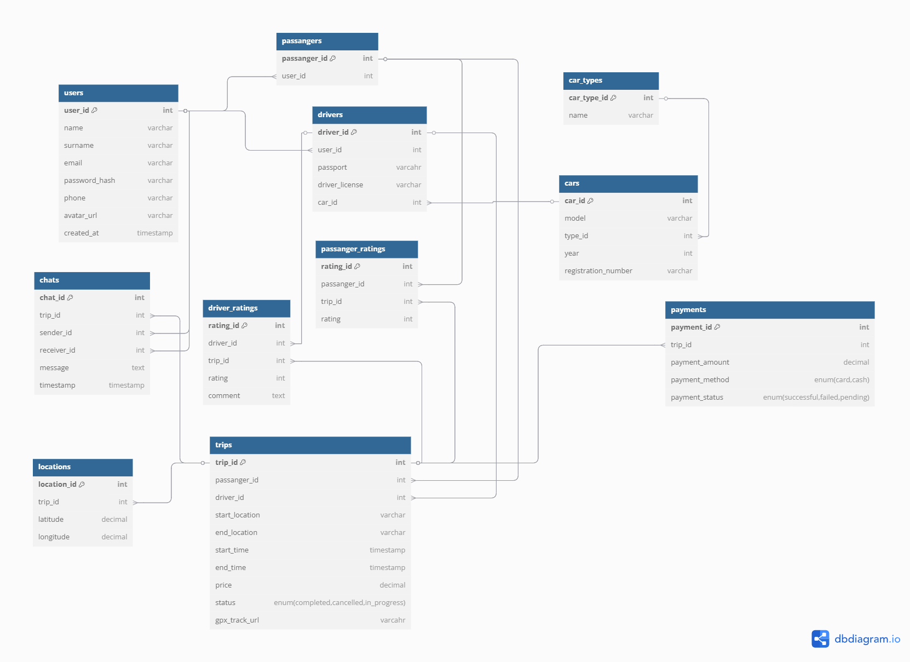
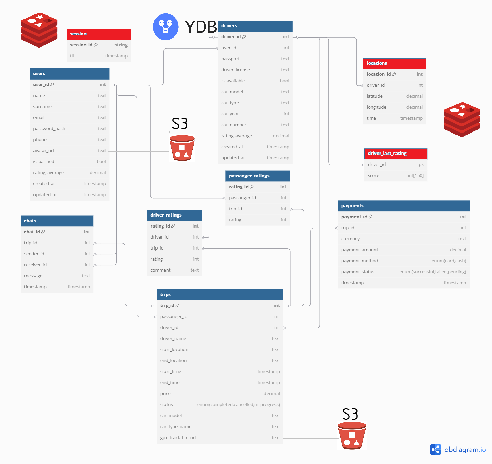

# Яндекс Go

## 1. Тема и целевая аудитория

Яндекс Go – сервис для заказа такси, доставки, каршеринга, аренды электросамокатов.
Изначально возник как сервис для заказа такси, поэтому имеет смысл рассматривать это за основной функционал.

### MVP

1. Регистрация/авторизация для пользователя/водителя
2. Выбор точки подачи/назначения
3. Выбор типа транспорта (легковой, грузовой) и их классы (эконом, комфорт и тд.)
4. Возможность принять заказ для водителя
5. Отслеживание положения автомобиля на карте
6. Чат между пассажиром и водителем
7. Рассчёт стоимости поездки
8. Оплата заказа
9. История поездок
10. Рейтинговая система. Возможность оценить поездку, водителя (для пассажира) и пассажира (для водителя)

### Целевая аудитория

* 42M+ MAU в СНГ [[1], [2], [3]](./README.md#источники)
* ~70% поездок в Яндекс Такси совершается в РФ [[2]](./README.md#источники)
* 91% жителей мегаполисов используют мобильный клиент [[5]](./README.md#источники) 
* 30% пассажиров Яндекс Такси — молодежь до 25 лет [4]
* 20% пользователей Яндекс Такси — семьи с детьми [4]
* 25% пользователей Яндекс Такси используют сервис для работы (деловые встречи и тп.) [4]
* ~94% рынка такси в РФ [7]

## 2. Расчёт нагрузки

### Продуктовые метрики

#### Аудитория

| Метрика | млн. пользователей |
| --- | --- |
| MAU | 42 |
| DAU (2019) [[6]](./README.md#источники) | 4.5 |

#### Действия

| Тип | Среднее в день на пользователя
| --- | --- |
| Регистрация | 0.0004 |
| Авторизация | 1.83 |
| Выбор точки подачи/назначения | 1.64 |
| Выбор типа транспорта | 1.64 |
| Возможность принять заказ | 1.46 |
| Отслеживание положения автомобиля на карте | 2.92 |
| Чат | 0.36 |
| Оплата заказа | 1.64 |
| История поездок | 0.034 |
| Оценки | 1.17 |

$DAU$ = $DAU_{пасс}$ (количество пассажиров в сутки) + $DAU_{вод}$ (количество водителей в сутки).
Согласно [8] в РФ 604 тыс. работающих водителей, а доля рынка Яндекс Такси [7] около 94%.
Таким образом, в Яндекс Такси задействовано примерено $DAU_{вод}=0,94 * 604 \approx 567$ тыс. водителей.
Водителям невыгоден простой, поэтому уместно считать, что все они ежедневно выезжают на заказы.
Что примерно бьётся, с данными Яндекса по числу водителей, совершающих поездки в месяц[9]  

Поездок в год `2.4B` [11]. Усредняя, получаем, что в день совершается `6.575M` поездок. 
Тогда на активного пассажира
$DAU_{пасс} \approx 4 млн$, выходит $\frac{6.575M}{4.0M DAU} = 1.64$ заказов.  

Предположим, что каждый раз, когда пользователь решает заказать такси, он заходит в приложение
и происходит аутентификация, количество которых можно принять числу, равному количеству пассажиров на долю заказов
и утроенное количество водителей (учитываем бытовые нужды, когда смартфон заблокирован),

Учитывая, что пользователь достаточно редко меняет тип и класс машины, положим, что запрос
на расчет маршрута и стоимости поедки меняется редко, и мобильный клиент запоминает последний тип транспортного средства.
Тогда число таких запросов естественно оставить равным $1.64$ шт/пользователь.

Количество принятых заказов, оценить можно так: общее количество заказов поделенное на количество водителей.
$6.575 \: млн. / 4.5 \: млн \approx 1,46$

Достаточно естественно положить, что каждую поездку водитель отслеживает в навигаторе, а пассажир
смотрит место движения машины до момента его прибытия к месту подачи, тогда такое действие оценим как среднее их арифметического
$\frac{4*1.64 + 11.6*0.567}{4.5} \approx 2.92$  

Примем, что во время каждого четвертого заказа осуществляется взаимодействие в чате между водителем и пассажиром.
$0.25 * 6.575 / 4.5 \approx 0.36$

История поездок. Довольно сложно определить, как часто пользуются этой фичей.
Понятно, что она может применяться для разных целей: например для компенсации деловых поездок.
Примем, что пользователь хотя бы раз в месяц заходит в историю поездок, тогда это будет $1/30 \approx 0.034$ действия в день

Оценивают пользователи как водителей, так и пассажиров. Сложно указать, какую долю составляют оцененные поездки
от обещего количества поездок, но исходя из личного опыта, примем 10% оценок от пассажиров и 70% от водителей.
Тогда можно подсчитать $\frac{0.1*6.575+0.7*6.575}{4.5} \approx 1.17$

### Технические метрики

#### Объём хранилища

| Данные | Размер по типу |
| --- | --- |
| Аватар пользователя* | 160 КБ |
| Личные данные** | 1.5 КБ |
| История поездки*** | 532 Б |
| Чат**** | 1632 Б |
| Маршрут (трек)***** | 13083 Б |
| **Итого** | ~177 КБ |

\* сжимается до 200x200 px формата webp  
\** Телефон + ФИО + водит. удостоверение + СТС + паспорт (кодировка UTF-8)
Получаем 4 * (12 + (6 + 5 + 9) + 89 + 99 + 116) ~ 1.5 КБ  
\*** Откуда + куда + время начала + время окончания + цена + водитель/пассажир + авто + оценка ~532 Б  
\**** Обычно сообщений в чате немного, он используется скорее для уточнения различных моментов
Пусть таких сообщений в среднем штуки 4, длинной около 100 символов, тогда для переписки получим ~4 * (4 * 100 + 8) = 1632Б  
\***** Маршрут обычно записывается в формате gpx, который содержит точки со следующей информацией:
* широта (string utf-8 14 байт)
* долгота (string utf-8 14 байт)
* высота (int32 2 байта)
* время (ISO-формат времени 19 символов = 19 байт)  

Предположим, что интервал отправления точек трека 5 секунд. Учитывая, что в среднем время поездки 22 мин 15 с [12], получим 267 точек трека. Для одной точки требуется 14 + 14 + 2 + 19 = 49 байт. Таким образом получаем для маршрута 49 * 267 = 13083 байта.

##### На одного пользователя 

Рассмотрим хранилище на 1 пользователя в течение года.

| Данные | Размер |
| - | - |
| Аватар | 160 КБ |
| Личные данные | 1,5 КБ |
| История поездок | 311 КБ |
| Чаты | 209,4 КБ |
| Маршруты (треки) | 7647,9 КБ |
| Итого | 8329,8 КБ |

Тогда для **всех** (49 млн.) [13] пользователей в год: **380,12 ТБ**

#### RPS

Можно считать, что в часы пик (вечер пятницы и субботы) RPS возрастает в 2 раза [10].
Метрики рассчитаем на основании действий пользователя.

| Действие | RPS средний | RPS пик |
| --- | --- | --- |
| Регистрация | 0.02 | 0.02 |
| Авторизация | 96 | 190 |
| Выбор точки подачи/назначения | 85 | 170 |
| Выбор типа транспорта | 85 | 170 |
| Возможность принять заказ водителем | 76 | 152 |
| Отслеживание положения на карте* | 20318 | 40636 |
| Чат | 19 | 38 |
| Расчёт стоимости | 76 | 152 |
| Оплата заказа | 76 | 152 |
| Просмотр истории поездок | 2 | 3 |
| Оценка | 61 | 122 |
| **Итого** | 20894 | 41778 |

* В сутки совершается 6,575 млн. поездок, учитывая среднее время поездки 22 мин 15 с (1335 с), получим общее время поездок в день 8_777_625_000 секунд. Исходя из предположения, что каждые 5 секунд передаются данные о маршруте, получим 20318 RPS.

#### Трафик

- Регистрация и авторизация  
    * Пиковый: 190 * 32 Б = 5.94 КБ/с
    * Суточный: 96 * 86400 * 32 = 0,25 ГБ/сутки
- Выбор точки подачи и назначения
    * Пиковый: 170 * (128 + 128) = 42,5 КБ/с
    * Суточный: 85 * 86400 * (128 + 128) = 1.75 ГБ/сутки
- Возможность принять заказ
    * Информация по заказу: 532 Б
    * Пиковый: 152 * 532 Б = 78,96 КБ/с
    * Суточный: 76 * 86400 * 532 = 3,25 ГБ/сутки
- Отслеживание положения на карте (навигация)
    * Информация по геолокации (gpx): 49 Б
    * Пиковый: 40636 * 49  = 1944,5 КБ/с
    * Суточный: 20318 * 86400 * 49 = 88,11 ГБ/сутки
- Чат
    * Объём сообщений: 1632 Б
    * Пиковый: 38 * 1632 = 60,56 КБ/с
    * Суточный: 19 * 86400 * 1632 = 2,5 ГБ/сутки
- Оплата заказа
    * Пусть сообщение об оплате передается в формате JSON по HTTP.
    Объект содержит информацию о стоимости, валюту, номер карты, дату истечения действия и CVC.
    Это будет примерно 200 Б. Кроме того, отправляются HTTP заголовки, что составляет ~350Б.
    Значит данные на одно сообщение ~550Б.
    * Пиковый: 152 * 550 Б = 81,6 КБ/с
    * Суточный: 76 * 86400 * 550 = 3,36 ГБ/сутки
- Просмотр истории
    * пусть человек смотрит последние 15 заказов, тогда для них имеем объём трафика
    15 * 532 Б = 7980 Б
    * Пиковый: 3 * 7980 Б = 23,4 КБ/с
    * Суточный: 2 * 86400 * 7980 = 1,28 ГБ/сутки
- Оценки:
    * пусть отсылается ID поезки и оценка, тогда одно сообщение будет ~ 16Б + 4Б = 20Б
    * Пиковый: 122 * 20Б = 2,4 КБ/с
    * Суточный: 61 * 86400 * 20 = 0,1 ГБ/сутки

Резюмируя

| Пункт                                   | Пиковый (КБ/с) | Суточный (ГБ/сутки) |
|-----------------------------------------|----------------|---------------------|
| Регистрация и авторизация              | 5,94           | 0,25                |
| Выбор точки подачи и назначения        | 42,5           | 1,75                |
| Возможность принять заказ              | 78,96          | 3,25                |
| Отслеживание положения на карте        | 1944,5         | 88,11               |
| Чат                                     | 60,56          | 2,5                 |
| Оплата заказа                          | 81,6           | 3,36                |
| Просмотр истории                       | 23,4           | 1,28                |
| Оценки                                  | 2,4            | 0,1                 |
| **Итого** | 0,017 Гб/с | 92,6 ГБ/сутки |

## 3. Глобальная балансировка нагрузки  

Для начала определим распределение пользователей внутри СНГ. Яндекс такси работает в таких странах СНГ, как:
* Россия
* Беларусь
* Казахстан
* Молдова 
* Армения
* Грузия
* Узбекистан
* Кыргызстан  

Есть информация по распределению загрузок приложения такс по странам [14], откуда получаем, что распределение пользователей примерно следующее:
- РФ - 72%
- Казахстан - 21%
- РБ - 4%
- остальные страны (преим. СНГ) - 3% 

Эти данные примерно бьются с распределением [11], что четверть поездок совершается вне РФ.

Приведена карта магистральных сетей передачи данных совмещенной с плотностью населения.

Руководствуясь расстояниями, численностью населения по регионам, его плотностью в регионах и расположением крупных узлов линий связи, выберем следующие места расположения ЦОДов.

Аудитория рассчитана из предположения, что удельная доля людей пользующихся сервисом такси во всех странах одинакова. Допущение для упрощения расчётов. Интерес представляют только проценты. 

1. ДЦ в Москве 
    * Основной ДЦ
    * Обслуживает:  
        * ЦФО России
    * Аудитория: 40 198 659  чел. (20,6 %)
2. ДЦ в Санкт-Петербурге
    * Обслуживает:
        * СЗФО в России
        * РБ
        * Молодову
    * Аудитория: 25 397 530 чел. (13,0 %)
3. ДЦ в Самаре
    * Обслуживает:
        * ПФО России
    * Аудитория: 28 943 000 чел. (14,9 %)
4. ДЦ в Краснодаре  
    * Обслуживает:
        * ЮФО России
        * СКФО России
        * Грузия
        * Армения
    * Аудитория: 33 542 496 чел. (17,2 %)
5. ДЦ в Нововсибирске
    * Обслуживает:
        * УрФО России
        * СФО России
        * ДФО России
        <!-- * Северный Казахстан -->
    * Аудитория: 39 580 261 чел. (20,3 %)
<!-- 5. ДЦ в Хабаровске:
    * Обслуживает:
        * ДФО России
    * Аудитория: 7 866 344 чел. ( %) -->
6. ДЦ в Алмате:
    * Обслуживает:
        * Казахастан
        * Узбекистан
        * Кыргызстан
    * Аудитория: 27 074 762 чел. (13,9 %)

### RPS по датацентрам

| Действие | RPS Москва | RPS СПб | RPS Самара | RPS Краснодар | RPS Новосибирск | RPS Алматы |
| --- | --- | --- | - | - | - | - |
| Регистрация | 0.004 | 0.0026 | 0.003 | 0.004 | 0.004 | 0.003 |
| Авторизация | 19.8 | 12.5 | 14.3 | 16.5 | 19.5 | 13.3 |
| Выбор точки подачи/назначения | 17.5 | 11.1 | 12.7 | 14.7 | 17.3 | 11.8 |
| Выбор типа транспорта | 17.5 | 11.1 | 12.7 | 14.7 | 17.3 | 11.8 |
| Возможность принять заказ водителем | 15.656 | 9.88 | 11.324 | 13.072 | 15.428 | 10.564 |
| Отслеживание положения на карте* | 4185.508 | 2641.34 | 3027.382 | 3494.696 | 4124.554 | 2824.202 |
| Чат | 3.914 | 2.47 | 2.831 | 3.268 | 3.857 | 2.641 |
| Расчёт стоимости | 15.656 | 9.88 | 11.324 | 13.072 | 15.428 | 10.564 |
| Оплата заказа | 15.656 | 9.88 | 11.324 | 13.072 | 15.428 | 10.564 |
| Просмотр истории поездок | 0.412 | 0.26 | 0.298 | 0.344 | 0.406 | 0.278 |
| Оценка | 12.566 | 7.93 | 9.089 | 10.492 | 12.383 | 8.479 |
| **Итого** | 4304.2 | 2716.2 | 3113.2| 3593.8 | 4241.5 | 2904.3 |

### BGP Anycast

Учитывая распределение по ДЦ в рамках одного региона и преимущественно в рамках 1 страны (большая часть аудитории) разумно использовать метод маршрутизации BGP anycast для балансировки нагрузки в рамках датацентров, поскольку запрос будет перенаправлятся к близжайшему в рамках маршрутов узлу системы.  

В некоторых случаях можно перенаправить трафик используя prepend'ы (искусственное "увеличение" длины маршрута)
и BGP community (маркировка маршрутов метками), а также local-prefernece.
Например, трафик из Беларуси надо направить в Санкт-Петербург и так, чтобы он не попадал в Москву.
Для этого можно использовать prepend, чтобы сделать маршрут из Беларуси в Москву менее предпочтительным, однако
это черевато тем, что другие маршруты в Москву (но не из Беларуси) могут стать длиннее, что приведет к перенаправлению
трафика в другие ДЦ, что повысит нагрузку на них.
В этом случае можно использовать маркировку маршрутов из Беларуси (community) для того,
чтобы направить трафик в Санкт-Петербург.

## 4. Локальная балансировка нагрузки

После достижения нужного ДЦ, пользовательский запрос нужно распределить внутри ДЦ.
Будем пользоваться архитектурой L7 балансировки, поскольку она является самым продвинутым методом, но от того более сложной.

1. Выберем в качестве L7 балансировщика **nginx**. Настроим его резвервировние сервера, на случай выхода из строя одного из nginx серверов.  
Он выполняет следующие функции:
* TLS-терминация  
* обратный прокси
* проверка авторизации (для защиты от DDoS)
* сжатие gzip
* обработка медленных соединений
* кэшировние
* перенаправление динамических запросов на поды kubernets
* отдача статических файлов

2. Физически сервера балансируется при помощи kubernetes для достижения максимально эффективного использования ресурсов.  
Кроме того, он управляет контейнерами, в котором исполняется  
kubernetes удобен, поскольку: 
    * Осуществляет автоматическое масштабирование (auto-scale)
    * Поддеривает микросервисную архитектуру
    * Повышает надёжность

3. Service Mesh. Для взаимодействия между микросервисами решено использовать consul.

## 5. Логическая схема БД

### Таблица, поля и связи между ними

На картинке ниже представлена логическая схема БД

В таблице ниже представлено краткое описание таблиц БД.

| Таблица               | Описание                                                                                  | Поля и их описание |
|-----------------------|-------------------------------------------------------------------------------------------|---------------------|
| **users**             | Данные пользователей (пассажиры и водители)                                               | `user_id`: Уникальный идентификатор пользователя (PK)  `name`: Имя пользователя  `surname`: Фамилия пользователя  `email`: Электронная почта пользователя  `password_hash`: Хэш пароля  `phone`: Номер телефона пользователя  `avatar_url`: Ссылка на аватар пользователя  `created_at`: Дата и время регистрации |
| **passengers**        | Данные о пассажирах                                    | `passenger_id`: Уникальный идентификатор пассажира (PK)  `user_id`: Внешний ключ, ссылающийся на таблицу **users** |
| **drivers**           | Данные о водителях                          | `driver_id`: Уникальный идентификатор водителя (PK)  `user_id`: Внешний ключ, ссылающийся на таблицу **users**  `passport`: Паспортные данные водителя  `driver_license`: Номер водительского удостоверения  `car_id`: Внешний ключ, ссылающийся на таблицу **cars** |
| **car_types**         | Типы автомобилей (например, эконом, комфорт).                                             | `car_type_id`: Уникальный идентификатор типа автомобиля (PK)  `name`: Название типа автомобиля (например, "эконом", "комфорт") |
| **cars**              | Данные о транспортных средствах                    | `car_id`: Уникальный идентификатор автомобиля (PK)  `model`: Модель автомобиля  `type_id`: Внешний ключ, ссылающийся на таблицу **car_types**  `year`: Год выпуска автомобиля  `registration_number`: Номер регистрации автомобиля |
| **trips**             | Информация о поездках (пассажир, водитель, местоположение, статус, стоимость).           | `trip_id`: Уникальный идентификатор поездки (PK)  `passenger_id`: Внешний ключ, ссылающийся на таблицу **passengers**  `driver_id`: Внешний ключ, ссылающийся на таблицу **drivers**  `start_location`: Начальная точка поездки  `end_location`: Конечная точка поездки  `start_time`: Время начала поездки  `end_time`: Время окончания поездки  `price`: Стоимость поездки  `status`: Статус поездки (например, "completed", "cancelled", "in_progress")  `gpx_track_url`: Ссылка на файл трека маршрута |
| **chats**             | Сообщения в чате между пассажиром и водителем | `chat_id`: Уникальный идентификатор чата (PK)  `trip_id`: Внешний ключ, ссылающийся на таблицу **trips**  `sender_id`: Внешний ключ, ссылающийся на отправителя сообщения в таблице **users**  `receiver_id`: Внешний ключ, ссылающийся на получателя сообщения в таблице **users**  `message`: Текст сообщения  `timestamp`: Временная метка для сообщения |
| **driver_ratings**    | Оценки водителей от пассажиров            | `rating_id`: Уникальный идентификатор оценки (PK)  `driver_id`: Внешний ключ, ссылающийся на таблицу **drivers**  `trip_id`: Внешний ключ, ссылающийся на таблицу **trips**  `rating`: Оценка водителя (например, от 1 до 5)  `comment`: Комментарий к оценке |
| **passenger_ratings** | Оценки пассажиров от водителей           | `rating_id`: Уникальный идентификатор оценки (PK)  `passenger_id`: Внешний ключ, ссылающийся на таблицу **users**  `trip_id`: Внешний ключ, ссылающийся на таблицу **trips**  `rating`: Оценка пассажира (например, от 1 до 5) |
| **locations**         | Координаты  точек старта и окончания   | `location_id`: Уникальный идентификатор местоположения (PK)  `trip_id`: Внешний ключ, ссылающийся на таблицу **trips**  `latitude`: Широта местоположения  `longitude`: Долгота местоположения |
| **payments**          | Платежи за поездки                                        | `payment_id`: Уникальный идентификатор платежа (PK)  `trip_id`: Внешний ключ, ссылающийся на таблицу **trips**  `payment_amount`: Сумма платежа  `payment_method`: Метод оплаты (например, "card", "cash")  `payment_status`: Статус платежа (например, "successful", "failed", "pending") |
| **session** | Содержит сессии пользователя | `session_id`: id-сессии  `ttl`: время жизни |
### Размеры данных и нагрузки на чтение/запись

| Таблица               | Чтение, IOPS | Запись, IOPS | Примечание |
|-----------------------| -------- | ---- | ----------- |
| **users**             | 327 | 45 | Запрос на получение осуществляется каждый раз, как происходит вход пользователя в приложение. При записи учтено изменение данных из предположения, что каждый 10000-ый пользователь меняет данные |
| **drivers**           | 78 | 0.005 | При чтении учитывается случаи заходов в историю поездок и при поездке |
| **car_types**         | 78 | 0 | Классы автомобилей предполагаются постоянными и редко изменяющимися. |
| **cars**              | 78 | 0.005 | Количество новых машин оценим в количество регистраций водителей. Количество чтений учитывает кроме поездок, еще и историю поездок |
| **trips**             | 265 | 131 | При записи учитывалось создание поездки и завершение.  При чтении - получение данных до и после поездки, и заходы в историю | 
| **chats**             |  164  |  82    | Читают оба общающихся |
| **driver_ratings**    |  76   |   8    |
| **passenger_ratings** |  76   |  53    |
| **locations**         |  40636 | 20318  | Рассчитано из предположения, что с интервалом 5 сек происходит получение данных о местоположении. А чтение в 2 раза выше (водитель и пассажир) |
| **payments**          |  76   | 76     |
| **session**           | 20894 | 52     |

### Консистентность

Косистентность данных имеет большое значение, особенно при операциях оплаты заказа - 
требуется использовать транзакции, что в хайлоаде считается не рекомендованным.

Имеет место **CAP-теорема**, которая гласит, что из трех характеристик:
консистентности (Consistency), доступности (Availability)
и устойчивости к разделению (Partition Tolerance) **можно гарантировать только две** из них.
В данном случае, считаю уместным обеспечить консистентность и устойчивость к разделению,
поскольку сервис должен сохранять свою функциональность в своих регионах, за которые он ответсвеннен,
и не было такого, что система оплаты ложилась после отказа одного из ЦОДов.
Доступность не критична, поскольку оплату может быть отложена - главное сохранить данные.

## 6. Физическая схема БД

### Размеры данных 

В Таблице представлен размер данных  
| Таблица               | Размер на 1 запись | Общий размер |
|-----------------------|--------| -- |
| **users**             | Пусть длина хэша (32 + 8 соль) байт, тогда размер записи будет (8 + 64 + 64 + 64 + 40 + 12 + 255 + 8 + 1 + 8 + 8 + 8) = 540 Б | 54 ГБ |
| **drivers**           | 289 Б  |   32.1 ГБ    |
| **trips**             | Оценим в 483 Б/запись  | 16.23 ТБ |
| **chats**             | Предположим, что средняя длина сообщения ~100 символов, т.е. ~200Б. (8 + 8 +8 + 8 + 200 + 8) = 240 Б | 1.99 ТБ  |
| **driver_ratings**    | Коментарий оценим в 60Б, тогда получим 92Б итого | 618.24 ГБ |
| **passenger_ratings** |  32Б      | 752.64 ГБ |
| **locations**         |  Следует использовать in-memory решения для быстрого доступа у данным маршрута. Порядка 40 Б/запись  | 65.4 ГБ/сутки* |
| **payments**          |  enum 4 байта, валюта 32 байта. Всего 72 Б/запись  | 1.9 ТБ |
| **session** | In-memory. зашифрованные AES256 данные + TTL. 40 байт | 0.17 ГБ/сутки* |
| **driver_last_rating** | 150 чисел последних оценок. 2450 Б | 1.75 ГБ |

(*) Предполагается, что время жизни записей 1 день.

### Индексы

| Таблица | Индекс |
| ------- | ------ |
| drivers | user_id (**hash**) - индекс для быстрого поиска водителя по id пользователя |
| trips | driver_id (**hash**) - быстрый поиск по водителям   passenger_id (**hash**) - быстрый поиск по пассажирам (история поездок) |
| chat | trip_id (**hash**) - для поиска по поездке |
| driver_ratings | driver_id (**hash**) - выстрый поиск по водителю |
| passenger_ratings | passenger_id (**hash**) - выстрый поиск по пассажиру |
| payments | trip_id (**hash**) - для проверки статуса оплаты по конкретной поездке|

### Денормализация

Чтобы избежать JOINов следует применять денормализацию. В данном случае запросы на чтение происходят чаще, поэтому надо оптимизировать некоторые таблицы на чтение. 

<!-- | Таблица | денормализация |
| - | - |
| trips | Добавим поля:   driver_name   car_model   car_type |
| drivers | rating_mark - закешированный рейтинг, который обнавляется асинхронно после добавления новых отзывов |
| users | rating_mark - закешированный рейтинг, который обнавляется асинхронно после добавления новых отзывов |  -->

### Выбор СУБД

В качестве основной СУБД используется YDB, поскольку она поддерживает SQL-подобный язык, транзакции (по ACID) и имеет хорошую горизонтальную масштабируемость.

Данные, к которым нужен доступ в онлайн-режиме следует хранить в in-memory решениях, например Redis.

| Таблица | БД | Примечание | 
| - | - | - |
| users | YDB |  Критичные данные: учетная запись. транзакции
| drivers | YDB | Данные о водителе (паспорт) и автомобиле (СТС) транзакции
| trips | YDB | Большой объем данных, транзакции |
| chats | YDB | Большой объём |
| driver_ratings | YDB | Транзакции |
| passanger_ratings | YDB | Транзакции |
| payments | YDB | Критически важные операции. Транзакции, строгая консистентность  |
| locations | redis | Очень большое количество запросов на чтение/запись. Следует использовать встроенный формат хранения геоданных. Быстрый доступ к данным |
| sessions | redis | Быстрый доступ к данным. Не страшно потерять. | 
| driver_last_rating | redis | Нужен быстрый доступ для рассчета рейтинга в реальном времени |

### Шардирование и резервирование

Документация YDB для достижения сохранности данных рекомендует использовать топологию **mirror-3-dc**.
Зоны отказа выберем из "треугольника" Москва-Краснодар-Новосибирск, чтобы обеспечить latency между ДЦ ~25 мс.
Резервирование и консистентность обеспечивается синхронной репликацией на основе RAFT-протокола.

Для таблиц `session`, `driver_last_rating` и `locations` развернём локальные
реплики Redis в рамках master-slave механизма. Расположить можно децентрализованно, поскольку эти данные фактически не зависят друг от друга и такое размещение поможет снизить RTT, расположив СУБД максимально близко к потребителю. Для репликации используются RDB-снапшоты. Для auto failover - Redis Sentinel.

## 7. Алгоритмы

## Источники
1. https://dev.go.yandex/blog/yandex-taxi-reliability-2024-05-30
2. https://tass.ru/ekonomika/18379431
3. https://ir.yandex.ru/blog/pro-rezultaty-4-kvartala-i-polnogo-2022-goda
4. https://dzen.ru/a/ZyItzK4YLArwvc53
5. https://www.rbc.ru/technology_and_media/10/10/2024/670681329a7947cf6806f69b
6. https://incountry.com/blog/interview-with-yandex-cloud-expert/
7. https://uscapital.ru/media/content_files/Prezentation__TM_4q_2023.pdf
8. https://ac.gov.ru/uploads/publications/taxi_app.pdf
9. https://highload.ru/spring/2021/abstracts/7219
10. https://yandex.ru/company/researches/2015/moscow/taxi
11. https://www.vedomosti.ru/business/news/2022/02/15/909391-yandeks-vpervie-raskril-dolyu-zarubezhnih-poezdok-v-servise-taksi
12. https://i.transport.mos.ru/flyover/taxi
13. https://tass.ru/ekonomika/22256607
14. https://www.statista.com/statistics/1253263/yandex-go-downloads-by-country/