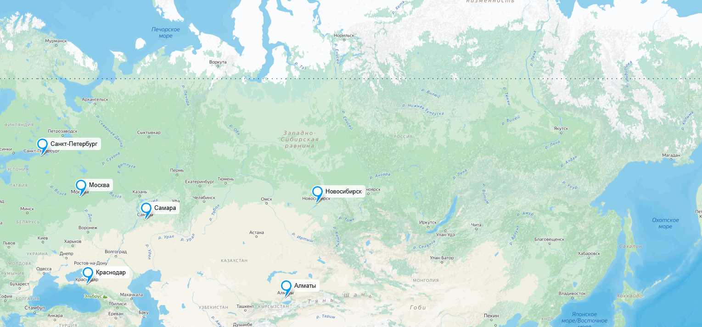
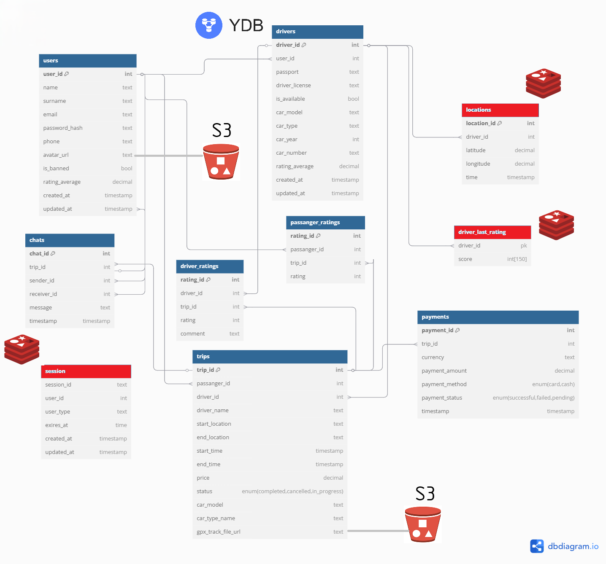

# Яндекс Go

## 1. Тема и целевая аудитория

Яндекс Go – сервис для заказа такси, доставки, каршеринга, аренды электросамокатов.
Изначально возник как сервис для заказа такси, поэтому имеет смысл рассматривать это за основной функционал.

### MVP

1. Регистрация/авторизация для пользователя/водителя
2. Выбор точки подачи/назначения
3. Выбор типа транспорта (легковой, грузовой) и их классы (эконом, комфорт и тд.)
4. Возможность принять заказ для водителя
5. Отслеживание положения автомобиля на карте
6. Чат между пассажиром и водителем
7. Рассчёт стоимости поездки
8. Оплата заказа
9. История поездок
10. Рейтинговая система. Возможность оценить поездку, водителя (для пассажира) и пассажира (для водителя)

### Целевая аудитория

* 42M+ MAU в СНГ [[1], [2], [3]](./README.md#источники)
* ~70% поездок в Яндекс Такси совершается в РФ [[2]](./README.md#источники)
* 91% жителей мегаполисов используют мобильный клиент [[5]](./README.md#источники) 
* 30% пассажиров Яндекс Такси — молодежь до 25 лет [4]
* 20% пользователей Яндекс Такси — семьи с детьми [4]
* 25% пользователей Яндекс Такси используют сервис для работы (деловые встречи и тп.) [4]
* ~94% рынка такси в РФ [7]

## 2. Расчёт нагрузки

### Продуктовые метрики

#### Аудитория

| Метрика | млн. пользователей |
| --- | --- |
| MAU | 42 |
| DAU (2019) [[6]](./README.md#источники) | 4.5 |

#### Действия

| Тип | Среднее в день на пользователя
| --- | --- |
| Регистрация | 0.0004 |
| Авторизация | 1.83 |
| Выбор точки подачи/назначения | 1.64 |
| Выбор типа транспорта | 1.64 |
| Возможность принять заказ | 1.46 |
| Отслеживание положения автомобиля на карте | 2.92 |
| Чат | 0.36 |
| Оплата заказа | 1.64 |
| История поездок | 0.034 |
| Оценки | 1.17 |

$DAU$ = $DAU_{пасс}$ (количество пассажиров в сутки) + $DAU_{вод}$ (количество водителей в сутки).
Согласно [8] в РФ 604 тыс. работающих водителей, а доля рынка Яндекс Такси [7] около 94%.
Таким образом, в Яндекс Такси задействовано примерено $DAU_{вод}=0,94 * 604 \approx 567$ тыс. водителей.
Водителям невыгоден простой, поэтому уместно считать, что все они ежедневно выезжают на заказы.
Что примерно бьётся, с данными Яндекса по числу водителей, совершающих поездки в месяц[9]  

Поездок в год `2.4B` [11]. Усредняя, получаем, что в день совершается `6.575M` поездок. 
Тогда на активного пассажира
$DAU_{пасс} \approx 4 млн$, выходит $\frac{6.575M}{4.0M DAU} = 1.64$ заказов.  

Предположим, что каждый раз, когда пользователь решает заказать такси, он заходит в приложение
и происходит аутентификация, количество которых можно принять числу, равному количеству пассажиров на долю заказов
и утроенное количество водителей (учитываем бытовые нужды, когда смартфон заблокирован),

Учитывая, что пользователь достаточно редко меняет тип и класс машины, положим, что запрос
на расчет маршрута и стоимости поедки меняется редко, и мобильный клиент запоминает последний тип транспортного средства.
Тогда число таких запросов естественно оставить равным $1.64$ шт/пользователь.

Количество принятых заказов, оценить можно так: общее количество заказов поделенное на количество водителей.
$6.575 \: млн. / 4.5 \: млн \approx 1,46$

Достаточно естественно положить, что каждую поездку водитель отслеживает в навигаторе, а пассажир
смотрит место движения машины до момента его прибытия к месту подачи, тогда такое действие оценим как среднее их арифметического
$\frac{4*1.64 + 11.6*0.567}{4.5} \approx 2.92$  

Примем, что во время каждого четвертого заказа осуществляется взаимодействие в чате между водителем и пассажиром.
$0.25 * 6.575 / 4.5 \approx 0.36$

История поездок. Довольно сложно определить, как часто пользуются этой фичей.
Понятно, что она может применяться для разных целей: например для компенсации деловых поездок.
Примем, что пользователь хотя бы раз в месяц заходит в историю поездок, тогда это будет $1/30 \approx 0.034$ действия в день

Оценивают пользователи как водителей, так и пассажиров. Сложно указать, какую долю составляют оцененные поездки
от обещего количества поездок, но исходя из личного опыта, примем 10% оценок от пассажиров и 70% от водителей.
Тогда можно подсчитать $\frac{0.1*6.575+0.7*6.575}{4.5} \approx 1.17$

### Технические метрики

#### Объём хранилища

| Данные | Размер по типу |
| --- | --- |
| Аватар пользователя* | 160 КБ |
| Личные данные** | 1.5 КБ |
| История поездки*** | 532 Б |
| Чат**** | 1632 Б |
| Маршрут (трек)***** | 13083 Б |
| **Итого** | ~177 КБ |

\* сжимается до 200x200 px формата webp  
\** Телефон + ФИО + водит. удостоверение + СТС + паспорт (кодировка UTF-8)
Получаем 4 * (12 + (6 + 5 + 9) + 89 + 99 + 116) ~ 1.5 КБ  
\*** Откуда + куда + время начала + время окончания + цена + водитель/пассажир + авто + оценка ~532 Б  
\**** Обычно сообщений в чате немного, он используется скорее для уточнения различных моментов
Пусть таких сообщений в среднем штуки 4, длинной около 100 символов, тогда для переписки получим ~4 * (4 * 100 + 8) = 1632Б  
\***** Маршрут обычно записывается в формате gpx, который содержит точки со следующей информацией:
* широта (string utf-8 14 байт)
* долгота (string utf-8 14 байт)
* высота (int32 2 байта)
* время (ISO-формат времени 19 символов = 19 байт)  

Предположим, что интервал отправления точек трека 5 секунд. Учитывая, что в среднем время поездки 22 мин 15 с [12], получим 267 точек трека. Для одной точки требуется 14 + 14 + 2 + 19 = 49 байт. Таким образом получаем для маршрута 49 * 267 = 13083 байта.

##### На одного пользователя 

Рассмотрим хранилище на 1 пользователя в течение года.

| Данные | Размер |
| - | - |
| Аватар | 160 КБ |
| Личные данные | 1,5 КБ |
| История поездок | 311 КБ |
| Чаты | 209,4 КБ |
| Маршруты (треки) | 7647,9 КБ |
| Итого | 8329,8 КБ |

Тогда для **всех** (49 млн.) [13] пользователей в год: **380,12 ТБ**

#### RPS

Можно считать, что в часы пик (вечер пятницы и субботы) RPS возрастает в 2 раза [10].
Метрики рассчитаем на основании действий пользователя.

| Действие | RPS средний | RPS пик |
| --- | --- | --- |
| Регистрация | 0.02 | 0.02 |
| Авторизация | 96 | 190 |
| Выбор точки подачи/назначения | 85 | 170 |
| Выбор типа транспорта | 85 | 170 |
| Возможность принять заказ водителем | 76 | 152 |
| Отслеживание положения на карте* | 20318 | 40636 |
| Чат | 19 | 38 |
| Расчёт стоимости | 76 | 152 |
| Оплата заказа | 76 | 152 |
| Просмотр истории поездок | 2 | 3 |
| Оценка | 61 | 122 |
| **Итого** | 20894 | 41778 |

* В сутки совершается 6,575 млн. поездок, учитывая среднее время поездки 22 мин 15 с (1335 с), получим общее время поездок в день 8_777_625_000 секунд. Исходя из предположения, что каждые 5 секунд передаются данные о маршруте, получим 20318 RPS.

#### Трафик

- Регистрация и авторизация  
    * Пиковый: 190 * 32 Б = 5.94 КБ/с
    * Суточный: 96 * 86400 * 32 = 0,25 ГБ/сутки
- Выбор точки подачи и назначения
    * Пиковый: 170 * (128 + 128) = 42,5 КБ/с
    * Суточный: 85 * 86400 * (128 + 128) = 1.75 ГБ/сутки
- Возможность принять заказ
    * Информация по заказу: 532 Б
    * Пиковый: 152 * 532 Б = 78,96 КБ/с
    * Суточный: 76 * 86400 * 532 = 3,25 ГБ/сутки
- Отслеживание положения на карте (навигация)
    * Информация по геолокации (gpx): 49 Б
    * Пиковый: 40636 * 49  = 1944,5 КБ/с
    * Суточный: 20318 * 86400 * 49 = 88,11 ГБ/сутки
- Чат
    * Объём сообщений: 1632 Б
    * Пиковый: 38 * 1632 = 60,56 КБ/с
    * Суточный: 19 * 86400 * 1632 = 2,5 ГБ/сутки
- Оплата заказа
    * Пусть сообщение об оплате передается в формате JSON по HTTP.
    Объект содержит информацию о стоимости, валюту, номер карты, дату истечения действия и CVC.
    Это будет примерно 200 Б. Кроме того, отправляются HTTP заголовки, что составляет ~350Б.
    Значит данные на одно сообщение ~550Б.
    * Пиковый: 152 * 550 Б = 81,6 КБ/с
    * Суточный: 76 * 86400 * 550 = 3,36 ГБ/сутки
- Просмотр истории
    * пусть человек смотрит последние 15 заказов, тогда для них имеем объём трафика
    15 * 532 Б = 7980 Б
    * Пиковый: 3 * 7980 Б = 23,4 КБ/с
    * Суточный: 2 * 86400 * 7980 = 1,28 ГБ/сутки
- Оценки:
    * пусть отсылается ID поезки и оценка, тогда одно сообщение будет ~ 16Б + 4Б = 20Б
    * Пиковый: 122 * 20Б = 2,4 КБ/с
    * Суточный: 61 * 86400 * 20 = 0,1 ГБ/сутки

Резюмируя

| Пункт                                   | Пиковый (КБ/с) | Суточный (ГБ/сутки) |
|-----------------------------------------|----------------|---------------------|
| Регистрация и авторизация              | 5,94           | 0,25                |
| Выбор точки подачи и назначения        | 42,5           | 1,75                |
| Возможность принять заказ              | 78,96          | 3,25                |
| Отслеживание положения на карте        | 1944,5         | 88,11               |
| Чат                                     | 60,56          | 2,5                 |
| Оплата заказа                          | 81,6           | 3,36                |
| Просмотр истории                       | 23,4           | 1,28                |
| Оценки                                  | 2,4            | 0,1                 |
| **Итого** | 0,017 Гб/с | 92,6 ГБ/сутки |

## 3. Глобальная балансировка нагрузки  

Для начала определим распределение пользователей внутри СНГ. Яндекс такси работает в таких странах СНГ, как:
* Россия
* Беларусь
* Казахстан
* Молдова 
* Армения
* Грузия
* Узбекистан
* Кыргызстан  

Есть информация по распределению загрузок приложения такс по странам [14], откуда получаем, что распределение пользователей примерно следующее:
- РФ - 72%
- Казахстан - 21%
- РБ - 4%
- остальные страны (преим. СНГ) - 3% 

Эти данные примерно бьются с распределением [11], что четверть поездок совершается вне РФ.

Приведена карта магистральных сетей передачи данных совмещенной с плотностью населения.

Руководствуясь расстояниями, численностью населения по регионам, его плотностью в регионах и расположением крупных узлов линий связи, выберем следующие места расположения ЦОДов.

Аудитория рассчитана из предположения, что удельная доля людей пользующихся сервисом такси во всех странах одинакова. Допущение для упрощения расчётов. Интерес представляют только проценты. 

1. ДЦ в Москве 
    * Основной ДЦ
    * Обслуживает:  
        * ЦФО России
    * Аудитория: 40 198 659  чел. (20,6 %)
2. ДЦ в Санкт-Петербурге
    * Обслуживает:
        * СЗФО в России
        * РБ
        * Молодову
    * Аудитория: 25 397 530 чел. (13,0 %)
3. ДЦ в Самаре
    * Обслуживает:
        * ПФО России
    * Аудитория: 28 943 000 чел. (14,9 %)
4. ДЦ в Краснодаре  
    * Обслуживает:
        * ЮФО России
        * СКФО России
        * Грузия
        * Армения
    * Аудитория: 33 542 496 чел. (17,2 %)
5. ДЦ в Нововсибирске
    * Обслуживает:
        * УрФО России
        * СФО России
        * ДФО России
        <!-- * Северный Казахстан -->
    * Аудитория: 39 580 261 чел. (20,3 %)
<!-- 5. ДЦ в Хабаровске:
    * Обслуживает:
        * ДФО России
    * Аудитория: 7 866 344 чел. ( %) -->
6. ДЦ в Алмате:
    * Обслуживает:
        * Казахастан
        * Узбекистан
        * Кыргызстан
    * Аудитория: 27 074 762 чел. (13,9 %)

### RPS по датацентрам

| Действие | RPS Москва | RPS СПб | RPS Самара | RPS Краснодар | RPS Новосибирск | RPS Алматы |
| --- | --- | --- | - | - | - | - |
| Регистрация | 0.004 | 0.0026 | 0.003 | 0.004 | 0.004 | 0.003 |
| Авторизация | 19.8 | 12.5 | 14.3 | 16.5 | 19.5 | 13.3 |
| Выбор точки подачи/назначения | 17.5 | 11.1 | 12.7 | 14.7 | 17.3 | 11.8 |
| Выбор типа транспорта | 17.5 | 11.1 | 12.7 | 14.7 | 17.3 | 11.8 |
| Возможность принять заказ водителем | 15.656 | 9.88 | 11.324 | 13.072 | 15.428 | 10.564 |
| Отслеживание положения на карте* | 4185.508 | 2641.34 | 3027.382 | 3494.696 | 4124.554 | 2824.202 |
| Чат | 3.914 | 2.47 | 2.831 | 3.268 | 3.857 | 2.641 |
| Расчёт стоимости | 15.656 | 9.88 | 11.324 | 13.072 | 15.428 | 10.564 |
| Оплата заказа | 15.656 | 9.88 | 11.324 | 13.072 | 15.428 | 10.564 |
| Просмотр истории поездок | 0.412 | 0.26 | 0.298 | 0.344 | 0.406 | 0.278 |
| Оценка | 12.566 | 7.93 | 9.089 | 10.492 | 12.383 | 8.479 |
| **Итого** | 4304.2 | 2716.2 | 3113.2| 3593.8 | 4241.5 | 2904.3 |

### BGP Anycast

Учитывая распределение по ДЦ в рамках одного региона и преимущественно в рамках 1 страны (большая часть аудитории) разумно использовать метод маршрутизации BGP anycast для балансировки нагрузки в рамках датацентров, поскольку запрос будет перенаправлятся к близжайшему в рамках маршрутов узлу системы.  

В некоторых случаях можно перенаправить трафик используя prepend'ы (искусственное "увеличение" длины маршрута)
и BGP community (маркировка маршрутов метками), а также local-prefernece.
Например, трафик из Беларуси надо направить в Санкт-Петербург и так, чтобы он не попадал в Москву.
Для этого можно использовать prepend, чтобы сделать маршрут из Беларуси в Москву менее предпочтительным, однако
это черевато тем, что другие маршруты в Москву (но не из Беларуси) могут стать длиннее, что приведет к перенаправлению
трафика в другие ДЦ, что повысит нагрузку на них.
В этом случае можно использовать маркировку маршрутов из Беларуси (community) для того,
чтобы направить трафик в Санкт-Петербург.

## 4. Локальная балансировка нагрузки

После достижения нужного ДЦ, пользовательский запрос нужно распределить внутри ДЦ.
Будем пользоваться архитектурой L7 балансировки, поскольку она является самым продвинутым методом, но от того более сложной.

1. Выберем в качестве L7 балансировщика **nginx**. Настроим его резвервировние сервера, на случай выхода из строя одного из nginx серверов.  
Он выполняет следующие функции:
* TLS-терминация  
* обратный прокси
* проверка авторизации (для защиты от DDoS)
* сжатие gzip
* обработка медленных соединений
* кэшировние
* перенаправление динамических запросов на поды kubernets
* отдача статических файлов

2. Физически сервера балансируется при помощи kubernetes для достижения максимально эффективного использования ресурсов.  
Кроме того, он управляет контейнерами, в котором исполняется  
kubernetes удобен, поскольку: 
    * Осуществляет автоматическое масштабирование (auto-scale)
    * Поддеривает микросервисную архитектуру
    * Повышает надёжность

3. Service Mesh. Для взаимодействия между микросервисами решено использовать consul.

## 5. Логическая схема БД

### Таблица, поля и связи между ними

На картинке ниже представлена логическая схема БД

В таблице ниже представлено краткое описание таблиц БД.

| **Таблица**            | **Назначение**                                                                                                                                                                        | **Основные поля**                                                                                                                                                                                                                                                                                                                                                                        |
|------------------------|---------------------------------------------------------------------------------------------------------------------------------------------------------------------------------------|-------------------------------------------------------------------------------------------------------------------------------------------------------------------------------------------------------------------------------------------------------------------------------------------------------------------------------------------------------------------------------------------|
| **users**              | Хранит учётные записи всех пользователей (как пассажиров, так и водителей).                                                                                                           | - `user_id` (PK) — уникальный идентификатор пользователя - `name`, `surname` — имя и фамилия - `email` — адрес эл. почты - `password_hash` — хэш пароля - `phone` — телефон - `is_banned` — флаг блокировки - `avatar_url` — URL аватара - `created_at`, `updated_at` — даты создания и обновления записи                                                                 |
| **passengers**         | Содержит данные, относящиеся к пассажирам (логическая надстройка над `users`), чтобы отделить роли пользователей.                                                                    | - `passenger_id` (PK) — уникальный идентификатор пассажира - `user_id` (FK → `users.user_id`) — связь с базовой учётной записью                                                                                                                                                                                                                                                       |
| **drivers**            | Данные о водителях, включая паспорт, права, машину и т.п.                                                                                                                            | - `driver_id` (PK) — уникальный идентификатор водителя - `user_id` (FK → `users.user_id`) — связь с базовой учётной записью - `passport`, `driver_license` — документы водителя - `car_id` (FK → `cars.car_id`) — автомобиль - `is_available` — доступен ли сейчас - `is_banned` — флаг блокировки - `created_at`, `updated_at` — даты создания и обновления |
| **car_types**          | Справочник типов автомобилей (эконом, комфорт, бизнес и т.д.).                                                                                                                        | - `car_type_id` (PK) — уникальный идентификатор типа - `name` — наименование типа (например, "эконом", "комфорт")                                                                                                                                                                                                                                                                     |
| **cars**               | Данные об автомобилях, которые используют водители.                                                                                                                                   | - `car_id` (PK) — уникальный идентификатор машины - `model` — модель автомобиля - `type_id` (FK → `car_types.car_type_id`) — тип/класс - `year` — год выпуска - `registration_number` — регистрационный номер                                                                                                                                                                |
| **trips**              | Информация о каждой поездке: кто пассажир, кто водитель, откуда-куда, время, стоимость, статус, ссылка на GPX-трек.                                                                   | - `trip_id` (PK) — уникальный идентификатор поездки - `passenger_id` (FK → `passengers.passenger_id`) — пассажир - `driver_id` (FK → `drivers.driver_id`) — водитель - `start_location`, `end_location` — начальная и конечная точки - `start_time`, `end_time` — время начала/окончания - `price` — цена - `status` — статус (completed, cancelled, in_progress) - `gpx_track_url` — ссылка на файл трека |
| **chats**              | Сообщения в чате между участниками поездки (водитель ↔ пассажир).                                                                                                                    | - `chat_id` (PK) — идентификатор чата - `trip_id` (FK → `trips.trip_id`) — поездка, к которой относится переписка - `sender_id`, `receiver_id` (оба FK → `users.user_id`) — кто отправил и кто получил - `message` — текст сообщения - `timestamp` — время отправки                                                                                                       |
| **driver_ratings**     | Оценки водителей (ставятся пассажирами).                                                                                                                                             | - `rating_id` (PK) — идентификатор оценки - `driver_id` (FK → `drivers.driver_id`) — оцениваемый водитель - `trip_id` (FK → `trips.trip_id`) — поездка, за которую оставили оценку - `rating` — числовая оценка (1..5) - `comment` — текстовый комментарий                                                                                                                      |
| **passenger_ratings**  | Оценки пассажиров (ставятся водителями).                                                                                                                                             | - `rating_id` (PK) — идентификатор оценки - `passenger_id` (FK → `passengers.passenger_id`) — оцениваемый пассажир - `trip_id` (FK → `trips.trip_id`) — поездка, за которую поставлена оценка - `rating` — числовая оценка (1..5)                                                                                                                                             |
| **locations**          | Хранит координаты, связанные с конкретной поездкой (например, промежуточные точки маршрута или старт/финиш); может дополняться временем фиксации.                                      | - `location_id` (PK) — уникальный id записи - `trip_id` (FK → `trips.trip_id`) — к какой поездке относится - `latitude`, `longitude` — координаты - `time` — отметка времени (например, когда координата была зафиксирована)                                                                                                                                                  |
| **payments**           | Информация об оплатах (сумма, статус, способ).                                                                                                                                       | - `payment_id` (PK) — уникальный идентификатор платежа - `trip_id` (FK → `trips.trip_id`) — к какой поездке относится - `currency` — валюта - `payment_amount` — сумма - `payment_method` — способ оплаты (card, cash) - `payment_status` — статус платежа (successful, failed, pending)                                                                                 |
| **session**            | Активные сессии пользователей (для авторизации в сервисе).                                                                                                                           | - `session_id` — идентификатор сессии (PK или уникальный ключ) - `user_id` (FK → `users.user_id`) — какой пользователь - `user_type` — роль (например, пассажир/водитель/админ) или доп. признак - `expires_at` — время истечения - `created_at`, `updated_at` — дата создания/обновления                                                                                   |

### Размеры данных и нагрузки на чтение/запись

| Таблица               | Чтение, IOPS | Запись, IOPS | Примечание |
|-----------------------| -------- | ---- | ----------- |
| **users**             | 327 | 45 | Запрос на получение осуществляется каждый раз, как происходит вход пользователя в приложение. При записи учтено изменение данных из предположения, что каждый 10000-ый пользователь меняет данные |
| **drivers**           | 78 | 0.005 | При чтении учитывается случаи заходов в историю поездок и при поездке |
| **car_types**         | 78 | 0 | Классы автомобилей предполагаются постоянными и редко изменяющимися. |
| **cars**              | 78 | 0.005 | Количество новых машин оценим в количество регистраций водителей. Количество чтений учитывает кроме поездок, еще и историю поездок |
| **trips**             | 265 | 131 | При записи учитывалось создание поездки и завершение.  При чтении - получение данных до и после поездки, и заходы в историю | 
| **chats**             |  164  |  82    | Читают оба общающихся |
| **driver_ratings**    |  76   |   8    |
| **passenger_ratings** |  76   |  53    |
| **locations**         |  40636 | 20318  | Рассчитано из предположения, что с интервалом 5 сек происходит получение данных о местоположении. А чтение в 2 раза выше (водитель и пассажир) |
| **payments**          |  76   | 76     |
| **session**           | 20894 | 52     |

### Консистентность

Косистентность данных имеет большое значение, особенно при операциях оплаты заказа - 
требуется использовать транзакции, что в хайлоаде считается не рекомендованным.

Имеет место **CAP-теорема**, которая гласит, что из трех характеристик:
консистентности (Consistency), доступности (Availability)
и устойчивости к разделению (Partition Tolerance) **можно гарантировать только две** из них.
В данном случае, считаю уместным обеспечить консистентность и устойчивость к разделению,
поскольку сервис должен сохранять свою функциональность в своих регионах, за которые он ответсвеннен,
и не было такого, что система оплаты ложилась после отказа одного из ЦОДов.
Доступность не критична, поскольку оплату может быть отложена - главное сохранить данные.

## 6. Физическая схема БД

### Размеры данных 

В Таблице представлен размер данных  
| Таблица               | Размер на 1 запись | Общий размер |
|-----------------------|--------| -- |
| **users**             | Пусть длина хэша (32 + 8 соль) байт, тогда размер записи будет (8 + 64 + 64 + 64 + 40 + 12 + 255 + 8 + 1 + 8 + 8 + 8) = 540 Б | 54 ГБ |
| **drivers**           | 289 Б  |   32.1 ГБ    |
| **trips**             | Оценим в 483 Б/запись  | 16.23 ТБ |
| **chats**             | Предположим, что средняя длина сообщения ~100 символов, т.е. ~200Б. (8 + 8 +8 + 8 + 200 + 8) = 240 Б | 1.99 ТБ  |
| **driver_ratings**    | Коментарий оценим в 60Б, тогда получим 92Б итого | 618.24 ГБ |
| **passenger_ratings** |  32Б      | 752.64 ГБ |
| **locations**         |  Следует использовать in-memory решения для быстрого доступа у данным маршрута. Порядка 40 Б/запись  | 65.4 ГБ/сутки* |
| **payments**          |  enum 4 байта, валюта 32 байта. Всего 72 Б/запись  | 1.9 ТБ |
| **session** | In-memory. зашифрованные AES256 данные + TTL. 40 байт | 0.17 ГБ/сутки* |
| **driver_last_rating** | 150 чисел последних оценок. 2450 Б | 1.75 ГБ |

(*) Предполагается, что время жизни записей 1 день.

### Индексы

| Таблица | Индекс |
| ------- | ------ |
| drivers | user_id (**hash**) - индекс для быстрого поиска водителя по id пользователя |
| trips | driver_id (**hash**) - быстрый поиск по водителям   passenger_id (**hash**) - быстрый поиск по пассажирам (история поездок) |
| chat | trip_id (**hash**) - для поиска по поездке |
| driver_ratings | driver_id (**hash**) - выстрый поиск по водителю |
| passenger_ratings | passenger_id (**hash**) - выстрый поиск по пассажиру |
| payments | trip_id (**hash**) - для проверки статуса оплаты по конкретной поездке|

### Денормализация

Чтобы избежать JOINов следует применять денормализацию. В данном случае запросы на чтение происходят чаще, поэтому надо оптимизировать некоторые таблицы на чтение. 

<!-- | Таблица | денормализация |
| - | - |
| trips | Добавим поля:   driver_name   car_model   car_type |
| drivers | rating_mark - закешированный рейтинг, который обнавляется асинхронно после добавления новых отзывов |
| users | rating_mark - закешированный рейтинг, который обнавляется асинхронно после добавления новых отзывов |  -->

### Выбор СУБД

В качестве основной СУБД используется YDB, поскольку она поддерживает SQL-подобный язык, транзакции (по ACID) и имеет хорошую горизонтальную масштабируемость.

Данные, к которым нужен доступ в онлайн-режиме следует хранить в in-memory решениях, например Redis.

| Таблица | БД | Примечание | 
| - | - | - |
| users | YDB |  Критичные данные: учетная запись. транзакции
| drivers | YDB | Данные о водителе (паспорт) и автомобиле (СТС) транзакции
| trips | YDB | Большой объем данных, транзакции |
| chats | YDB | Большой объём |
| driver_ratings | YDB | Транзакции |
| passanger_ratings | YDB | Транзакции |
| payments | YDB | Критически важные операции. Транзакции, строгая консистентность  |
| locations | redis | Очень большое количество запросов на чтение/запись. Следует использовать встроенный формат хранения геоданных. Быстрый доступ к данным |
| sessions | redis | Быстрый доступ к данным. Не страшно потерять. | 
| driver_last_rating | redis | Нужен быстрый доступ для рассчета рейтинга в реальном времени |

### Шардирование и резервирование

Документация YDB для достижения сохранности данных рекомендует использовать топологию **mirror-3-dc**.
Зоны отказа выберем из "треугольника" Москва-Краснодар-Новосибирск, чтобы обеспечить latency между ДЦ ~25 мс.
Резервирование и консистентность обеспечивается синхронной репликацией на основе RAFT-протокола.

Для таблиц `session`, `driver_last_rating` и `locations` развернём локальные
реплики Redis в рамках master-slave механизма. Расположить можно децентрализованно, поскольку эти данные фактически не зависят друг от друга и такое размещение поможет снизить RTT, расположив СУБД максимально близко к потребителю. Для репликации используются RDB-снапшоты. Для auto failover - Redis Sentinel.

## 7. Алгоритмы

| Алгоритм | Область применения | Примечание |
| - | - | - |
| Поиск ближайшего водителя | Поздки| Идея в следующем:   1. Поиск по геолокации (из Redis с ближайшими координатами)   2. Фильтрация по доступности, категории машины, не забанен ли водитель   3. Расчёт метрики предпочтения водителя (рейтинг, время подачи и тп.)   4. Сортировка по метрике   5. Отправка информации о закакзе водителю. |
| Расчёт стоимости поездки | Поездки, оплата | Сложность заключается в том, что если время и расстояние рассчитано плохо, то фактические затраты будут отличаться от рассчитанных. К тому же маршруты через дворы и прочие территории с узкими дорогами и частым маневрированием физически утомительнее. Кроме того огромную роль играют пробки, погода и время суток. Этот аспект является краеугольной частью рассчёта стоимости поездки.   Общая идея в следующем:   1. Определяем оптимальный маршрут и считаем предполагаемое расстояние и время   2. Рассчитыввем по такой или схожей формуле $Стоимость=(Подача+(ЦенаЗаКм×Дистанция)+(ЦенаЗаМин×ВремяВПути))$   $×КоэффициентСпроса×КомиссияСервиса+Доп.Услуги−Скидки$,   Подача - базовая стоимость в зависимости от категории транспорта, ЦенаЗаКм и ЦенаЗаМин тоже зависят от типа транспорта   3. Дополнительно, к стоимости учитывается платное ожидание |
| Геокодирование | Сопоставление координат адресам | Вопрос скорее к сфере технологий. Разворачивается локально Nominatim с нужными данными OpenStreetMap. Из коробки Nominatim поддерживает прямое и обратное геокодирование, поиск и различные языки. |
| Прокладка маршрутов | Поездки | Самая сложная задача. Как правило - используется алгоритм A* + эвристики.   1. Подготавливается граф дорог, например с помощью GraphHopper. В крупных городах дополнительно сворачивают менее значимые дороги с помощью эвристик (например Constraction Hierarchies)   2. Используются данные о дорожной обстановке (пробки, аварии, ремонты), время суток, погода, а если этих данных нет, то используются модели обученные на исторических данных. Кроме того, модели учитывают такие обстоятельства, как время ожидания на светофорах, повороты и сложные развязки. Таким образом корректируются веса   3. Учитываются заторы и дорожные события в реальном времени, которые обновляют веса - в этом случае используется автоматический перепрокладчик. |
| Эвристический алгоритм выбора точки подачи и назначения | Поездки | Представим, что имеем большое здание, которое имеет один парадный вход, может оказаться так, что маршрут будет проложен к точке, которая физически ближе к центру масс фигуры здания и распаложена в противоположной стороне от входа. Тогда, чтобы добраться до этой точки следует обойти здание, что для клиента неудобно.   Для решения проблемы можно использовать крупные сервисы для геокодирования, но это деньги. Другое решение - использовать слои OSM и сбор статистики.   1. Выбираем слой, который содержит входы если они явно указаны, если его нет - используем ML модель (обучена на местах частой остановки), если и её нет - используем центр масс фигуры объекта.   2. По месту назначения ищем точки дорог (можно ли проехать, напрвление движения, есть ли зоны для остановки и тп) и фильтруем по доступности   3. Считаем метрику от расстояния до входа, можно ли развернуться, часто ли отменяли здесь заказ и тп, сортируем от наибольшего |

Остановимся поподробнее на следующем алгоритме.

### Алгоритм прокладки маршрута

В первую очередь, на картографическом основании строится Дорожный граф.
Дорожный граф представляет собой взвешенный ориентированный граф, где вершины - перекрёстки, а рёбра - дороги.  
Его весами выступают:
1. протяженность дороги
2. средняя скорость движения на участке - скорость потока
3. время - главная метрика  

Далее, поверх основного графа строится виртуальный граф.
Он оперирует таким понятием как "адрес" - вершина на ребре дорожного графа и имеющая направления.
Кроме того, вместо ребер - улиц оригинального графа используются "манёвры".

Кроме того, дополнительно учитываются такие особенности, как перекрытия (в этом случае, ребро помечается как
имеющее бесконечный вес времени), запрет поворотов (реализуется на уровне связей в графе), 
тип транспортного средства (на дорогах бывают ограничения, к примеру, на грузовики), а также сезонность
и многое другое.

Далее, стоит задача определения скорости потока.
Ежемоментно огрмное количество треков поступает от различных водителей, датчков и тп. На основании этого и рассчитывается скорость потока. Однако есть и проблемы.
Первое, с чем приходится сталкиваться - неточность GPS-треков, что фиксится интерполяцией и корректировкой координатных точек.
  

Водитель в потоке может замедлиться перед поворотом, или остановиться перед каким то магазином, чтобы что-то купить. В то время как другие водители будут двигаться без изменеия скорости.
Чтобы не общая метрика скорости потока была корректной, треки с остановками и торможениями будут выбрасываться из расчёта.

Наконец, время.
Расчёт времени маршрута происходит в 2 этапа:  
**Маршрутный** . Определяется прмерный маршрут при помощи алгоритма Дейкстры на дорожном графе.
Здесь используется оптимизация по областям, для каждой из которой можно подсчитать оптимальные варианты пересечений. 
Такой областью может быть, например, небольшой городок, через который проходит всего одна междугородняя трасса — въехать и выехать из города можно только по ней. 
Таким образом можно хранить предварительно просчитанный через такую зону маршрут

**Временной**. На этом этапе уже используется виртуальный граф. Назанчение этого этапа точнение времени проезда по уже выбранному пути. ВременнАя модель учитывает полный набор признаков для каждого маневра, а также параметры запроса пользователя из приложения: текущее местное время и различные макрохарактеристики маршрута — например, коэффициент перепробега (отношение длины реального маршрута из А в Б к расстоянию между этими точками по прямой). На выходе временнАя модель выдаёт уточнённое время проезда.

Например, на этом этапе просчитываются затраты времени на повороты. Дорожный граф не учитывает время поворота: поворт на загруженной дороге со светоформ и поворот на развязке занимают разное время. Вот подобные задачи и решает этап.

В данном случае используется модель, обученная на данных маршрутах и позволяющая просчитывать задержки такого рода. Используемая модель - Линейный Матрикснет.

## 7. Технологии

| Технология                  | Область применения                                                            | Мотивационная часть                                                                                                  |
|-----------------------------|-------------------------------------------------------------------------------|-----------------------------------------------------------------------------------------------------------------------|
| **Go**                      | **Backend**                                           | Высокая производительность, асинхронность из коробки |
| **TypeScript**             | **Frontend**        | Статическая типизация, популярность, множество различных библиотек.         |
| **Kotlin/Swift**  | **Мобильные приложения** | >90% заказов происходит с мобильных устройств. Доступ к функциям ОС (геолокация, push-уведомления). Быстрая работа и удобство для большинства пользователей. |
| **Docker**                  | **Контейнеризация**                                                           | Быстрое масштабирование и деплой, хорошо сочетается с Kubernetes.                       |
| **Kubernetes**             | **Оркестрация контейнеров**                        | Автомасштабирование, мониторинг состояния подов, высокая надёжность и гибкость деплоя.                           |
| **Nginx**          | **Балансировка нагрузки, обратный прокси**               | TLS-терминация, gzip-сжатие, гибкое маршрутизирование запросов, высокая пропускная способность.                       |
| **YDB**                    | **СУБД**                                        | Реляционная БД, оптимизрованная под хайлоад из коробки |
| **Redis**                  | **In-memory БД**                                   | Высокая скорость чтения/записи, поддержка геопространственных операций |
| **Nominatim + PostgreSQL** | **Геокодирование**                           | Геокодирование, поддержка OSM, возможность поднять локальный инстанс         |
| **GraphHopper**            | **Построение и хранение дорожных графов, прокладка маршрутов**                | Интеграция с OSM, возможность допиливать логику алгоритмов.       |
| **OpenStreetMap**          | **Исходные геоданные**                                                        | Открытая база (PBF формат), постоянно обновляется и дополняется, не требует лицензий.                                 |
| **S3** | **Объектное хранилище** | Гибкость, масштабируемость, надёжность |
| **Prometheus + Grapfana** | **мониторинг** | Сбор метрик, отрисовка графиков, поддержка kubernetes |

<!-- | **Consul / Service Mesh**  | **Сервис-дискавери, конфигурация, мониторинг микросервисов**                   | ЦОО (централизованное обнаружение и обмен метаданными), упрощённое взаимодействие между сервисами, гибкое управление трафиком. | -->

Рассмотрим, примерные технологии для прокладки маршрута.
Самая первая задача, которая возникает при решении этой проблемы - получение электронной карты.
Для этого можно использовать опен сорс решение - OpenStreetMap.
OpenStreetMap предоставляет данные в формате PBF.

Далее нужно, так это определить координаты точек по адресу - геокодирование.
Для этого можно развернуть сервер Nominatim. 
Он принимает данные OSM, помещает их в PostgreSQL и индексирует их. Дополнительно данные можно реплицировать
Nominatim позволяет осуществлять прямое и обратное геокодированрие.
Главная проблема сервиса: сложно масштабировать, нужно кастомное шардировать.

Для строительства дорожного графа можно использовать GraphHopper.
Это открытая билблиотека для которая может строить графы из данных OSM.
Кроме того, можно расширить GraphHopper кастомной логикой маршрутизации, например
подключить эвристики, описанные в предыдущем разделе, а также использовать
нейросетевые модели.

## Источники
1. https://dev.go.yandex/blog/yandex-taxi-reliability-2024-05-30
2. https://tass.ru/ekonomika/18379431
3. https://ir.yandex.ru/blog/pro-rezultaty-4-kvartala-i-polnogo-2022-goda
4. https://dzen.ru/a/ZyItzK4YLArwvc53
5. https://www.rbc.ru/technology_and_media/10/10/2024/670681329a7947cf6806f69b
6. https://incountry.com/blog/interview-with-yandex-cloud-expert/
7. https://uscapital.ru/media/content_files/Prezentation__TM_4q_2023.pdf
8. https://ac.gov.ru/uploads/publications/taxi_app.pdf
9. https://highload.ru/spring/2021/abstracts/7219
10. https://yandex.ru/company/researches/2015/moscow/taxi
11. https://www.vedomosti.ru/business/news/2022/02/15/909391-yandeks-vpervie-raskril-dolyu-zarubezhnih-poezdok-v-servise-taksi
12. https://i.transport.mos.ru/flyover/taxi
13. https://tass.ru/ekonomika/22256607
14. https://www.statista.com/statistics/1253263/yandex-go-downloads-by-country/
15. https://yandex.ru/company/technologies/yaprobki/
16. https://yandex.ru/company/technologies/routes/
17. https://habr.com/ru/companies/yandex/articles/330524/
18. https://habr.com/ru/companies/yandex/articles/344954/
19. https://www.digimap.ru/products/index?section=15